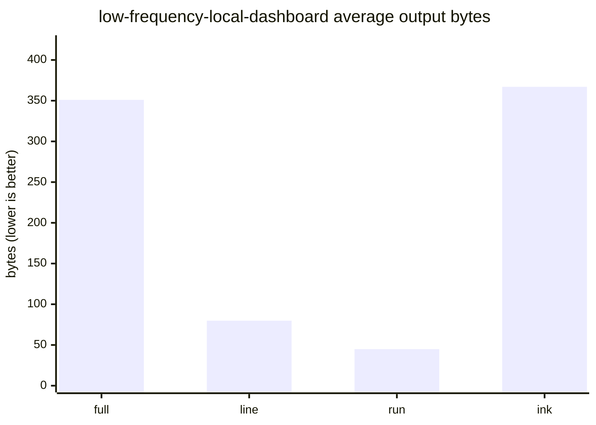
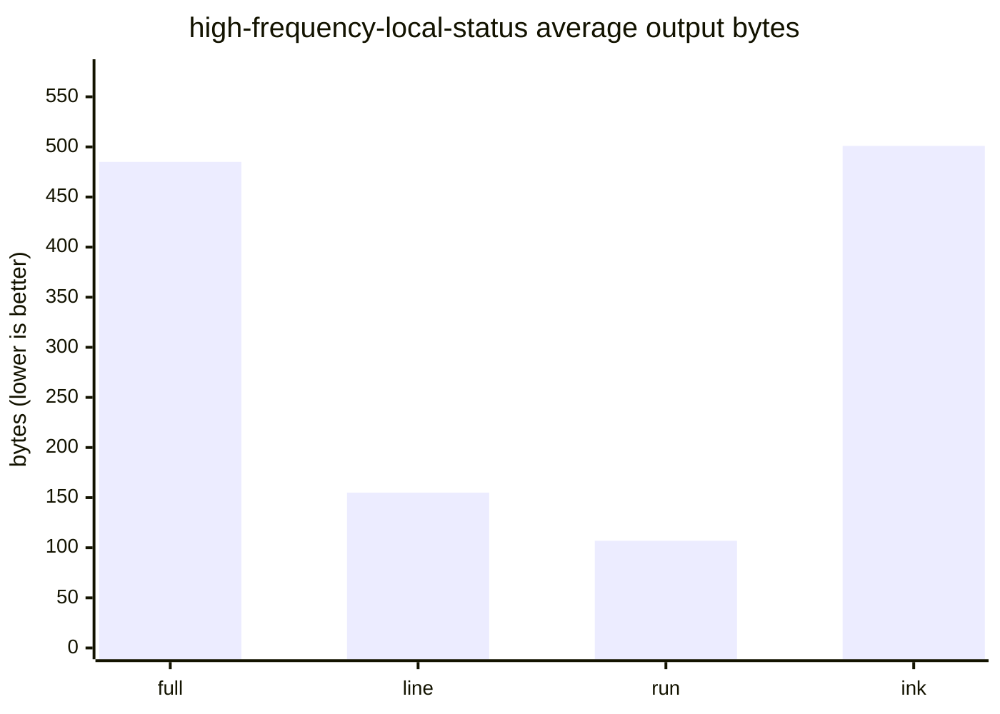
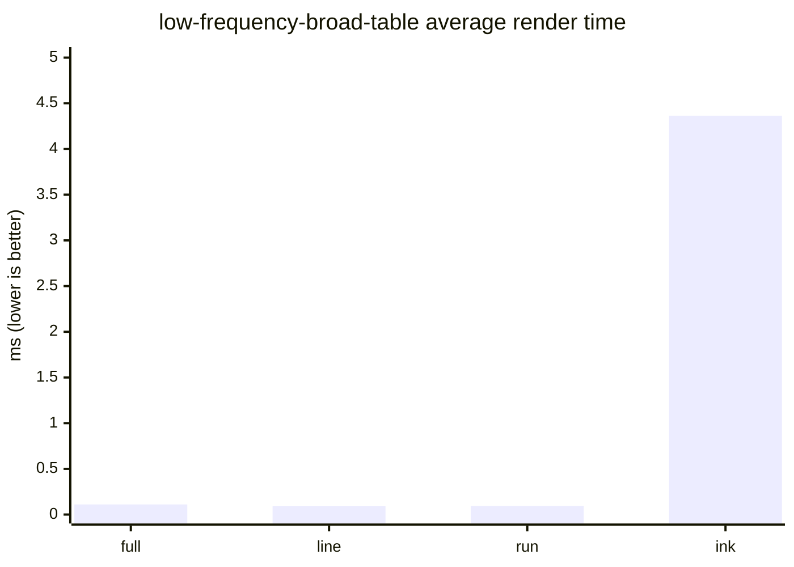
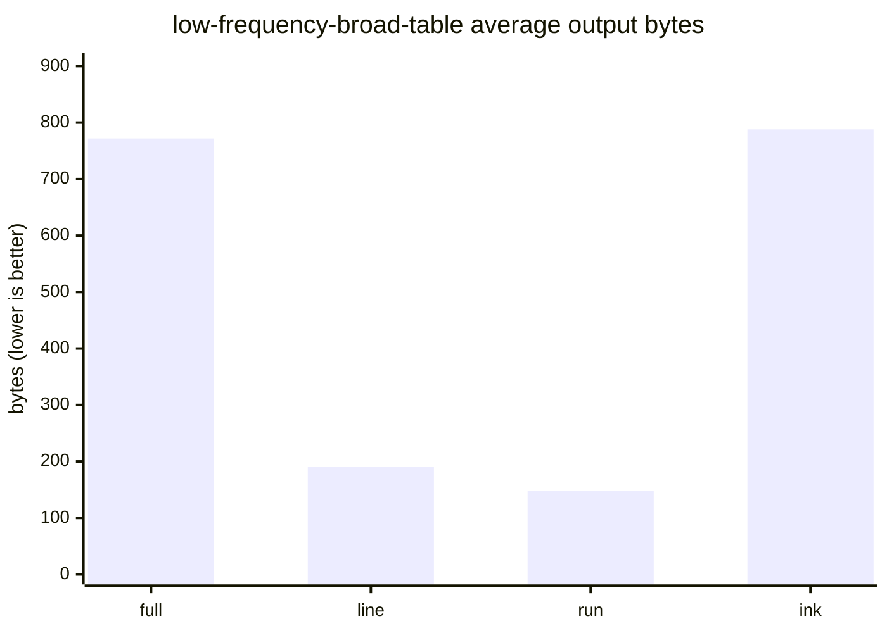
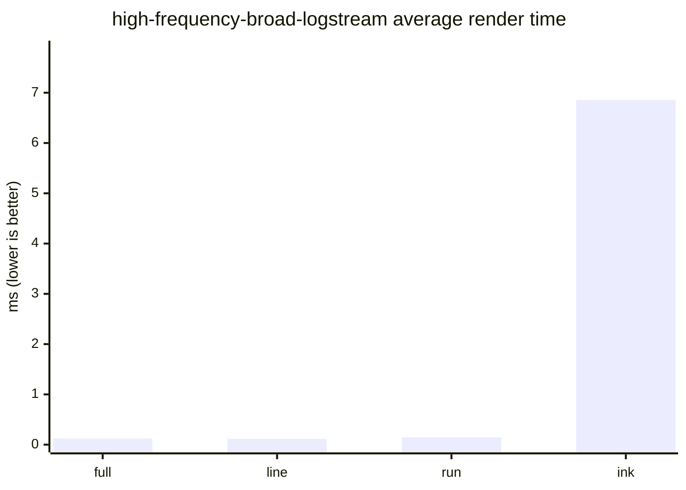
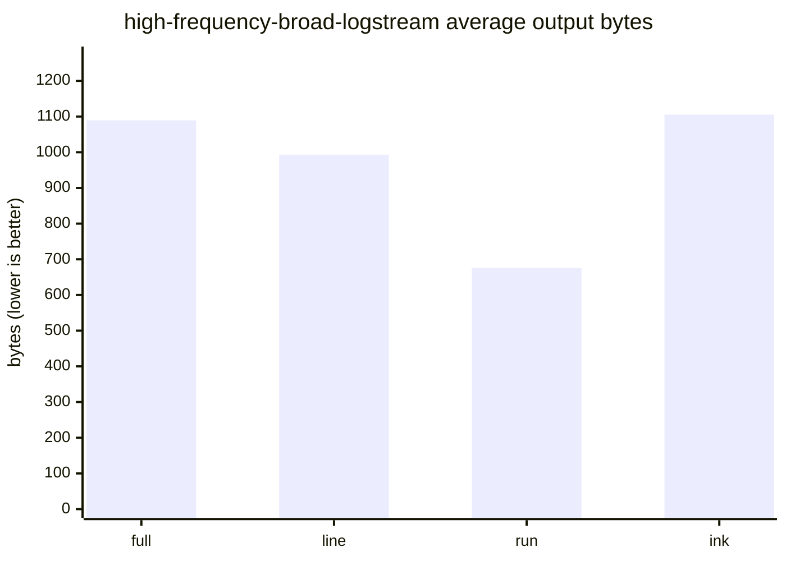
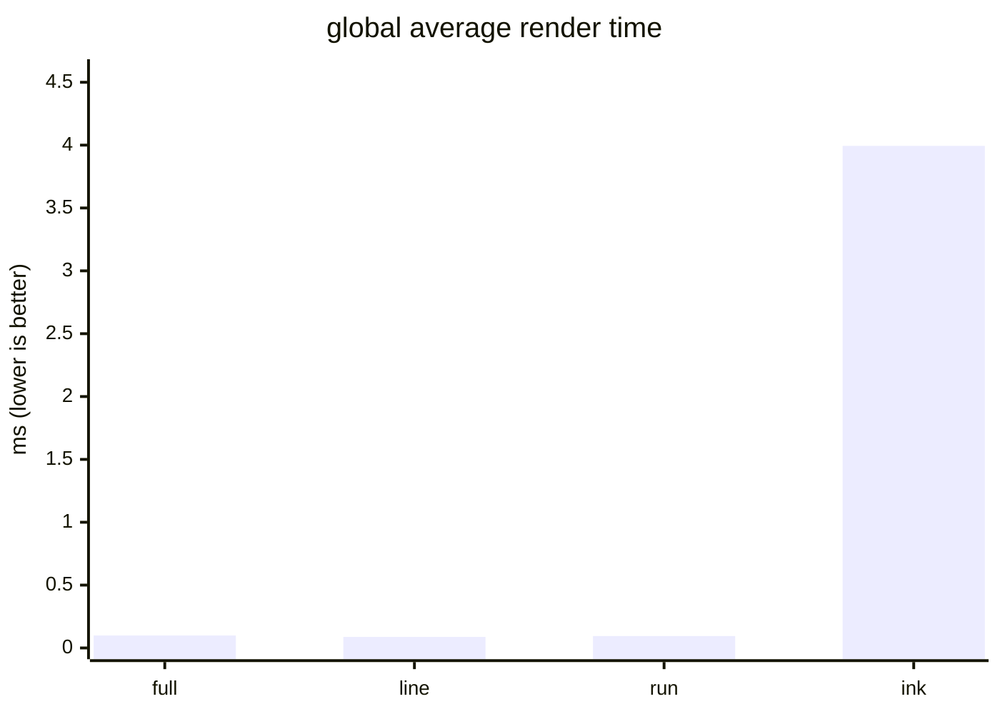
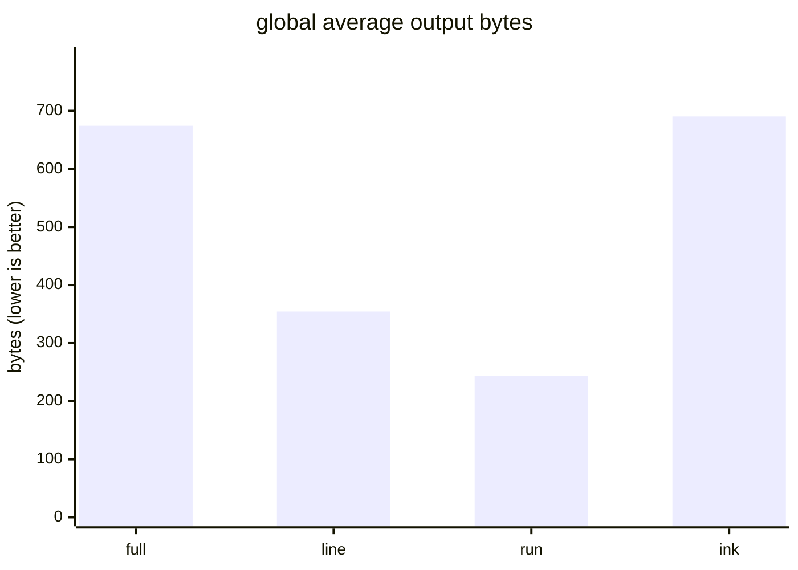

# Render benchmark report

This report compares Tinky rendering modes with Ink across representative
application scenarios grouped by update frequency and update scope.
It reports only rendering speed and output bytes.

## What this benchmark measures

- Rendering speed (`average ms`, lower is better).
- Output size (`average bytes`, lower is better).

## Environment

| field                      | value    |
| -------------------------- | -------- |
| Platform                   | darwin   |
| OS release                 | 25.3.0   |
| Architecture               | arm64    |
| CPU model                  | Apple M5 |
| CPU cores                  | 10       |
| Total memory (GiB)         | 16.00    |
| Bun version                | 1.3.9    |
| Node compatibility version | v24.3.0  |
| Terminal columns           | 80       |
| Terminal rows              | 24       |

## Scenario matrix

Representative scenarios selected by `update frequency × update scope`.

| scenario                       | frequency | scope | typical use case           |
| ------------------------------ | --------- | ----- | -------------------------- |
| low-frequency-local-dashboard  | low       | local | Dashboard KPI card refresh |
| high-frequency-local-status    | high      | local | Worker status spinner      |
| low-frequency-broad-table      | low       | broad | Ticket table page switch   |
| high-frequency-broad-logstream | high      | broad | Live log stream            |

## Scenario detail charts

Each scenario is classified by update frequency and update scope.
The charts only include average rendering speed and average bytes.

### low-frequency-local-dashboard

- Frequency: `low`
- Scope: `local`
- Use case: Dashboard KPI card refresh
- Description: Low-frequency local refresh, representing dashboard metric card updates.

#### Average render time (ms)

#### Average output bytes

### high-frequency-local-status

- Frequency: `high`
- Scope: `local`
- Use case: Worker status spinner
- Description: High-frequency local refresh, representing spinner/progress in status rows.

#### Average render time (ms)

#### Average output bytes

### low-frequency-broad-table

- Frequency: `low`
- Scope: `broad`
- Use case: Ticket table page switch
- Description: Low-frequency broad refresh, representing list/table page replacement.

#### Average render time (ms)

#### Average output bytes

### high-frequency-broad-logstream

- Frequency: `high`
- Scope: `broad`
- Use case: Live log stream
- Description: High-frequency broad refresh, representing continuous log stream updates.

#### Average render time (ms)

#### Average output bytes

## Global summary charts

Global values are averages of per-scenario averages for each mode.

#### Average render time (ms)

#### Average output bytes

## Final summary vs Ink

Percentages compare each mode against `ink` using global averages.
Negative percentages mean lower ms or lower bytes than Ink.

| mode | average ms | speed vs ink | average bytes | bytes vs ink |
| ---- | ---------- | ------------ | ------------- | ------------ |
| full | 0.10       | -97.5%       | 674.35        | -2.3%        |
| line | 0.09       | -97.8%       | 354.46        | -48.7%       |
| run  | 0.09       | -97.6%       | 243.89        | -64.7%       |
| ink  | 3.99       | +0.0%        | 690.35        | +0.0%        |

## Notes

- This benchmark is a report-only tool and does not fail based on performance thresholds.
- Byte metrics are calculated from UTF-8 output.
